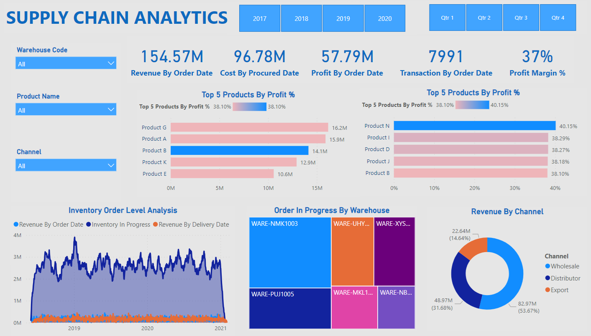
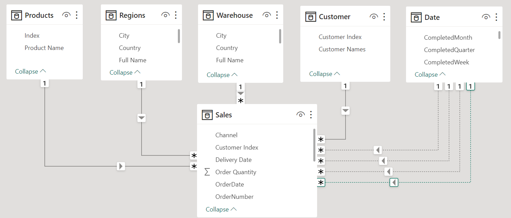

<h2 align="center">Suppy Chain Analytics with Power BI</h2>

<a href="https://app.powerbi.com/view?r=eyJrIjoiM2FjZjMzNzktNTQ4YS00MjAzLWJlMTQtY2FlNzY2ZmU1ODI3IiwidCI6ImMyOTMyNDU1LWIzZTctNDJhYi1hY2ExLWZhNTNmMjcxN2EyNSJ9">Link to Interactive Dashboard</a>

In this project, I conducted an in depth analytics of various facets of the supply chain using Power BI. The focus was on deriving actionable insights from the data to optimize processes, enhance decision making, and improve overall operational efficiency.

1. Top 5 Products By Profit %

2. Inventory Order Level Analysis

3. Order In Progress By Warehouse

4. Revenue By Channel
